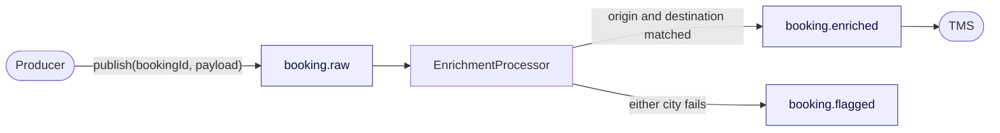
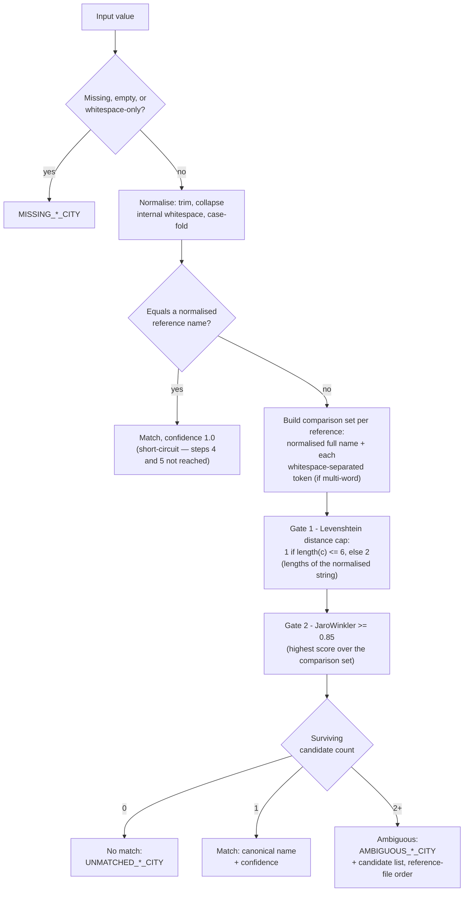
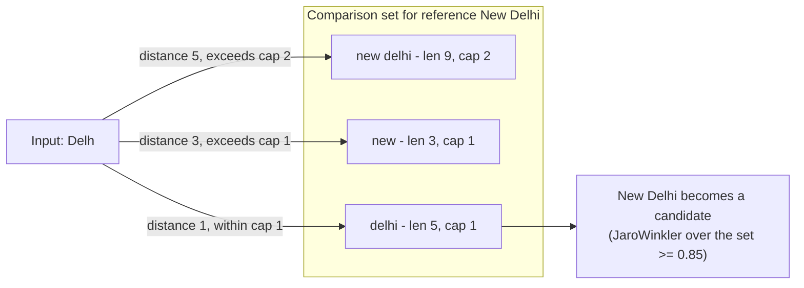
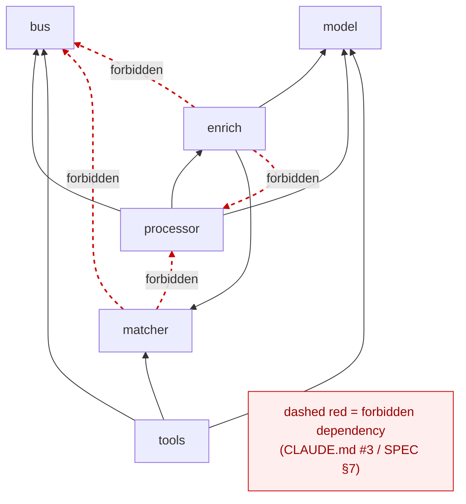
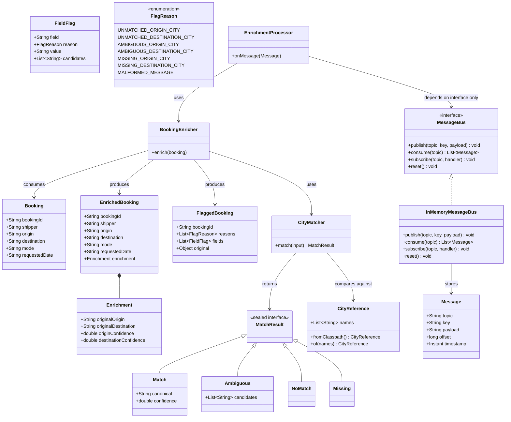
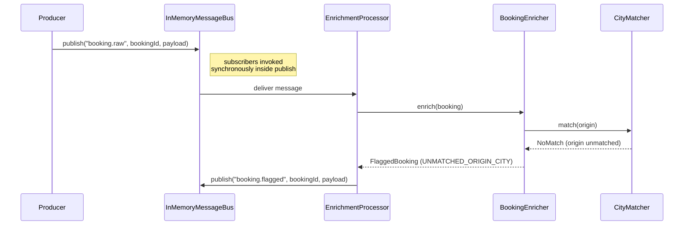
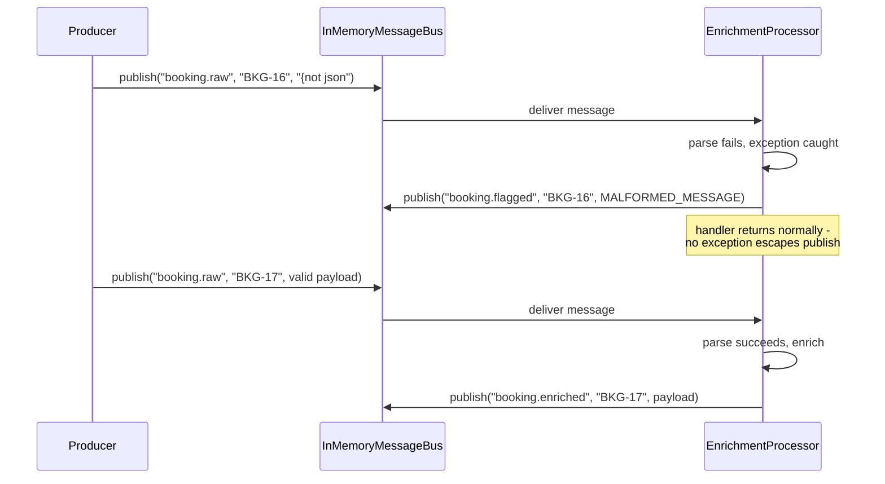
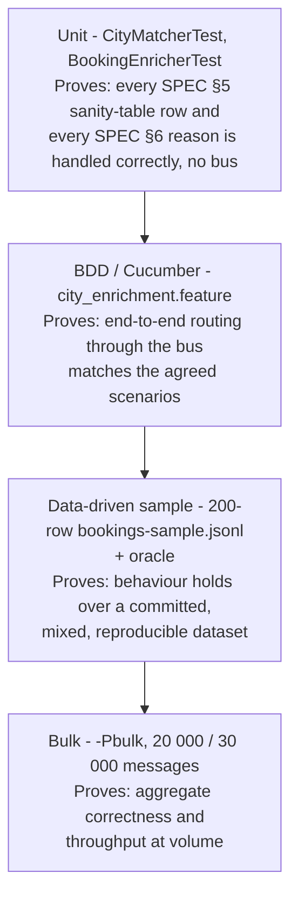
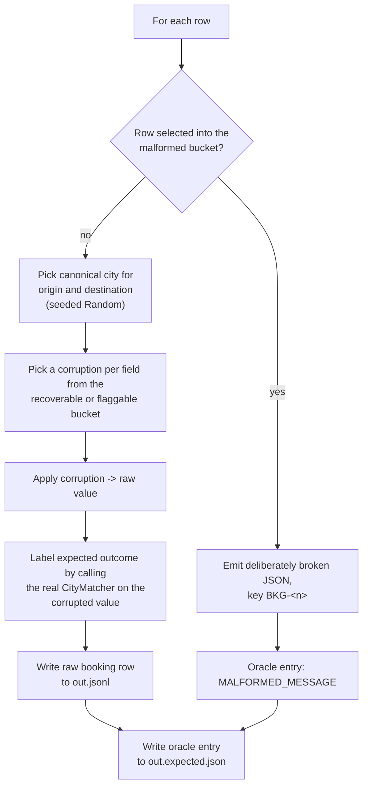

# Architecture — City Enrichment BDD Harness

## Reading this document

`SPEC.md` is the contract. This file does not restate or reinterpret it — it is a
visual companion: the same rules, drawn as diagrams, with tables for the
enumerable facts. Where a diagram needs a label that isn't a class, field, topic,
reason, or threshold name taken directly from `SPEC.md`, that is called out in the
prose next to it. If this document and `SPEC.md` ever disagree, `SPEC.md` wins.

---

## 1. Message flow

What it shows: a raw booking enters on `booking.raw`, `EnrichmentProcessor` is the
only consumer, and its output lands on exactly one of the two output topics before
`booking.enriched` reaches TMS.

`EnrichmentProcessor` is the only class that knows topic names (SPEC §7), so the
routing decision is centralised in one place. The whole-booking rule (SPEC §2) means
there is no partial path: a booking never emits to both `booking.enriched` and
`booking.flagged`, and it never emits to neither — every input produces exactly one
output message.

## 2. The matching contract (SPEC §5)

What it shows: the full seven-step decision tree applied independently to `origin`
and `destination`, in order, with the two fuzzy-matching gates and the three
candidate-count outcomes.

Exact match short-circuiting (step 3) is what guarantees an input equal to one
reference name is never reported as ambiguous with another (SPEC §5.3). The two
gates in step 4 are independent: a reference must clear both the distance cap *and*
the 0.85 Jaro-Winkler floor to become a candidate at all, and only then does the
candidate count decide the outcome.

## 3. Comparison-set construction

What it shows: how a multi-word reference name expands into several strings to
compare against, each with its own distance cap, using `New Delhi` from the SPEC
§5 worked example.

| Comparison-set member | Length (normalised) | Distance cap |
|---|---|---|
| `new delhi` | 9 | 2 |
| `new` | 3 | 1 |
| `delhi` | 5 | 1 |

Without tokenisation, `Delh` is distance 5 from `new delhi` as a whole and would
never reach it. Comparing against the token `delhi` instead brings the distance
down to 1, inside the cap for a 5-character string — this is precisely the
mechanism SPEC §5.4 describes as "what lets a short input reach a multi-word
reference."

## 4. Package layering (SPEC §7)

What it shows: the six packages under `com.cozentus.enrichment`, the dependencies
implied by their documented responsibilities, and the direction `matcher/` and
`enrich/` must never point in.

`CityMatcher` and `BookingEnricher` have no dependency on `bus/` or `processor/`
(SPEC §7 rules); `EnrichmentProcessor` depends only on the `MessageBus` interface.
This keeps the matching and enrichment logic testable in plain unit tests with no
bus, no topics, and no I/O — the bulk of `CityMatcherTest` and `BookingEnricherTest`
(SPEC §8.1) exercise `matcher/` and `enrich/` in complete isolation from `bus/`.

## 5. Class model

What it shows: the model, matcher, enrich, and bus types named across SPEC §4, §5,
and §7, with the sealed `MatchResult` hierarchy and the `MessageBus` interface as
given verbatim in SPEC §7. Fields on `Booking`, `EnrichedBooking`, `FlaggedBooking`,
and `FieldFlag` are taken from the JSON payload shapes in SPEC §4; method names on
`CityMatcher` and `BookingEnricher` are illustrative of the documented behaviour
("`Booking -> EnrichedBooking | FlaggedBooking`", SPEC §7), since SPEC does not give
Java signatures for those two classes the way it does for `MessageBus`.

`MatchResult` is sealed to exactly the four outcomes SPEC §5 defines — a match, an
ambiguous set, no match, or a missing value — so every consumer of a match result
is forced (by the compiler, via exhaustive `switch`) to handle all four; there is no
fifth silent case.

## 6. Sequence — a flagged booking

What it shows: a booking whose origin cannot be matched, from publish on
`booking.raw` through to publish on `booking.flagged`, entirely inside one
synchronous call.

`InMemoryMessageBus` invokes subscribers synchronously inside `publish` (SPEC §7,
`MessageBus` section) — by the time `publish` returns to the producer, the flagged
booking has already been enriched, evaluated, and republished. This is what makes
negative assertions ("no booking X appears on `booking.enriched`") deterministic
without polling or timeouts.

## 7. Sequence — a malformed message

What it shows: an unparseable payload flagged as `MALFORMED_MESSAGE`, and the next,
well-formed message still being processed afterward — the "processor never throws"
invariant in action.

For `MALFORMED_MESSAGE`, `fields` is empty, `original` holds the raw string,
`bookingId` is `null`, and the message key is the Kafka key if present, else
`"UNKNOWN"` (SPEC §4). Catching the parse failure inside the handler — rather than
letting it propagate — is what keeps one bad message from taking down the
subscription and silently starving every message behind it.

## 8. Test pyramid (SPEC §8)

What it shows: the four test layers, from fastest/narrowest to slowest/broadest,
and what each one proves that the others don't.

Each layer trades speed for scope: unit tests pin down the matching and
enrichment logic itself; Cucumber pins down routing and message shape as agreed
scenarios; the 200-row sample checks the same logic against a larger, committed,
git-tracked fixture; the bulk profile checks it holds at the volumes the real
service would see, and is excluded from the default `mvn verify` run precisely
because it is slow (SPEC §8.4).

## 9. Task roadmap (CLAUDE.md)

What it shows: the seven build tasks in dependency order, with the `mvn -q verify`
gate CLAUDE.md requires between each one. Task 1 (scaffold, matcher,
`CityMatcher`, `CityMatcherTest`) is complete and green; tasks 2-7 are pending.

```mermaid
flowchart LR
    T1["Task 1<br/>Scaffold + matcher"]
    G1{{"mvn -q verify"}}
    T2["Task 2<br/>Enricher"]
    G2{{"mvn -q verify"}}
    T3["Task 3<br/>Bus + processor"]
    G3{{"mvn -q verify"}}
    T4["Task 4<br/>BDD feature + steps"]
    G4{{"mvn -q verify"}}
    T5["Task 5<br/>Sample data"]
    G5{{"mvn -q verify"}}
    T6["Task 6<br/>Bulk profile"]
    G6{{"mvn -q verify<br/>+ mvn -q verify -Pbulk"}}
    T7["Task 7<br/>README"]
    G7{{"mvn -q verify"}}

    T1 --> G1 --> T2 --> G2 --> T3 --> G3 --> T4 --> G4 --> T5 --> G5 --> T6 --> G6 --> T7 --> G7

    classDef done fill:#dfd,stroke:#2a2,color:#141;
    classDef pending fill:#eee,stroke:#999,color:#333;
    class T1 done
    class T2,T3,T4,T5,T6,T7 pending
```

CLAUDE.md's task order is a strict sequence: "work one task at a time. After each,
run the gate, summarise what changed, and stop for review." Task 6 additionally
requires `mvn -q verify -Pbulk` at both 20 000 and 30 000 messages before it counts
as done.

## 10. Data generator flow (SPEC §9)

What it shows: `BookingDataGenerator`'s per-row algorithm — pick a city, pick a
corruption from the configured `--mix` bucket, apply it, then label the row by
running the *real* `CityMatcher`, never by inferring the outcome from the
corruption's name.

Labelling by re-running `CityMatcher` (step 4, SPEC §9) — instead of assuming
`recoverable` always recovers — guarantees the generated data and the matching
contract cannot drift apart: a `recoverable` corruption that happens to destroy a
name still lands in the flagged oracle, because the matcher, not the bucket name,
decides the truth.

---

## Flag reasons (SPEC §6)

| Origin | Destination |
|---|---|
| `UNMATCHED_ORIGIN_CITY` | `UNMATCHED_DESTINATION_CITY` |
| `AMBIGUOUS_ORIGIN_CITY` | `AMBIGUOUS_DESTINATION_CITY` |
| `MISSING_ORIGIN_CITY` | `MISSING_DESTINATION_CITY` |

Plus `MALFORMED_MESSAGE`, for unparseable input (not field-specific). `reasons` is
a list; both cities failing yields two entries, ordered origin then destination.

## Sanity table (SPEC §5)

| Input | Result |
|---|---|
| `Mumbi` | Mumbai (d=1) |
| `now delhi` | New Delhi (d=1) |
| `Bangalor` | Bangalore (d=1) |
| `MUMBAI` | Mumbai (exact after normalise) |
| `  New   Delhi ` | New Delhi (exact after normalise) |
| `Pne` | Pune (d=1 vs `pune`, length 4 <= 6 so d<=1 allowed; JW 0.925) |
| `Pn` | flagged (d=2 > 1) |
| `Warsaw` | flagged, no candidate within distance |
| `Delh` (base list) | New Delhi (token `delhi`, d=1) |
| `Delh` (list + `Delhi`) | flagged AMBIGUOUS, candidates `New Delhi`, `Delhi` |
| `""` | flagged, MISSING |

## Key invariants

- **One topic per booking.** A booking appears on exactly one of
  `booking.enriched` / `booking.flagged` — never both, never neither (SPEC §2;
  CLAUDE.md #4: "A `bookingId` never appears on both `booking.enriched` and
  `booking.flagged`").
- **The processor never throws.** Bad input produces a `booking.flagged` message
  with `MALFORMED_MESSAGE`; the next message on `booking.raw` is still processed
  (SPEC §7, `EnrichmentProcessor` section; CLAUDE.md #5).
